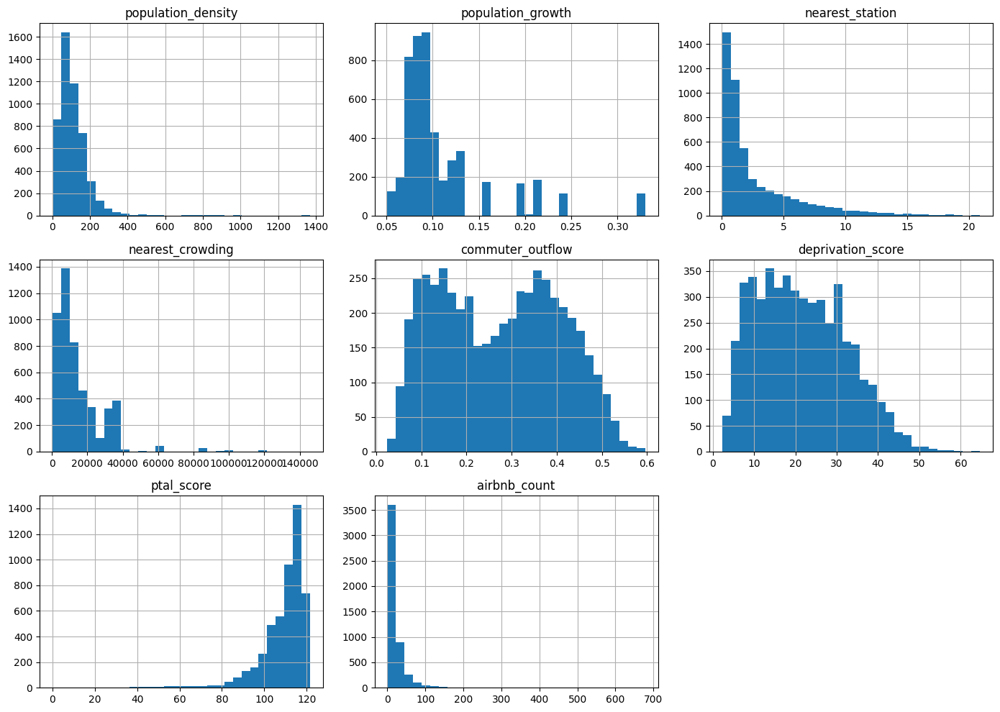
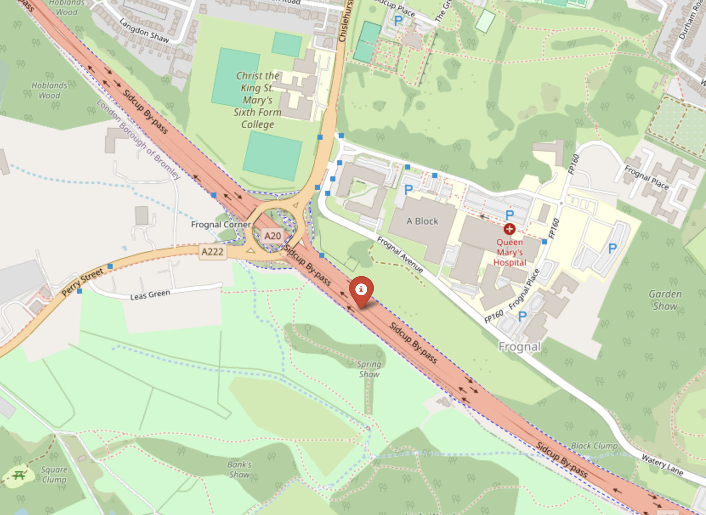
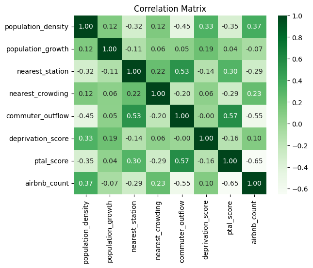

# London Tube Station Recommendation — Susquehanna Datathon

A data-driven recommendation for the location of a new London Underground station, produced as an advisory analysis for Transport for London (TfL). A quantitative scoring framework is applied across all 4,994 Lower Layer Super Output Areas (LSOAs) in London to identify the most underserved location — **Orpington, in the London Borough of Bromley** — proposed as a terminus on an extended Bakerloo line.

## Usage and Context

### Scoring Framework

Every LSOA is scored on eight variables capturing transport need and demand, under three weighting schemes reflecting different priorities.

- **Ridership-Focused** — favours variables likely to increase Underground ridership.
- **Equity-Focused** — favours deprived areas that benefit most from better public transport.
- **Balanced** — equal weight (15%) to all primary variables.

### Sensitivity Analysis

Rankings from each scheme are combined with a Borda count to surface the most consistently underserved candidate, making the recommendation robust to weighting assumptions.

- **Top Candidates** — south-east London ranks consistently highest; LSOA E01000739 (Bromley) is first overall.
- **Borda Count** — aggregates the three schemes into a single robust ranking.

### Geographic Analysis

The selected LSOA is mapped to a practical construction site by inspection, chosen for accessibility and available land.

- **Map** — proposed station at 51.417601°N, 0.100140°E, adjacent to Queen Mary's Hospital and the Sidcup bypass.
- **Routing** — a Bakerloo line extension serving Orpington as terminus, aligning with TfL's own plans.

## Data and Variables

Eight variables sourced from public datasets and APIs, joined on LSOA code.

- **population_density** — Residents per hectare (ONS Census 2021).
- **population_growth** — Projected borough growth 2025–2040 (London Datastore).
- **nearest_station** — Distance to nearest Underground station (TfL StopPoint API).
- **nearest_crowding** — Avg. entries into nearest station, Tue–Thu (TfL Station Usage).
- **commuter_outflow** — Proportion commuting by car or bus (ONS Census 2021).
- **deprivation_score** — Index of Multiple Deprivation (IMD 2019).
- **ptal_score** — Public transport accessibility level (London Datastore 2015).
- **airbnb_count** — Listing count per LSOA (Inside AirBnB 2025).

## Methodology Stack

### Preprocessing

Cleaning and structuring raw data for the scoring system.

- **Joining** — all variables merged on LSOA code into a single DataFrame.
- **Extrapolation** — borough-level variables and new LSOAs filled from borough medians.

### Transformation

Preparing variables for fair comparison.

- **Log transforms** — `log(1 + x)` applied to right-skewed variables.
- **Normalisation** — min-max scaling to `[0, 1]`; PTAL inverted so higher = greater need.

### Scoring & Ranking

Producing the final recommendation.

- **Composite scores** — weighted sums under each of the three schemes.
- **Borda count** — combines rankings into the final overall result.

### Ridership Estimate

Sizing the catchment for the proposed station.

- **Catchment** — population of LSOAs within 3.0km (~76,883 people).
- **Uptake** — ~25% assumed, giving ~19,000 estimated riders served.

## Author

Matthew Ryan — BSc Mathematics with Data Science, London School of Economics. © 2026.
